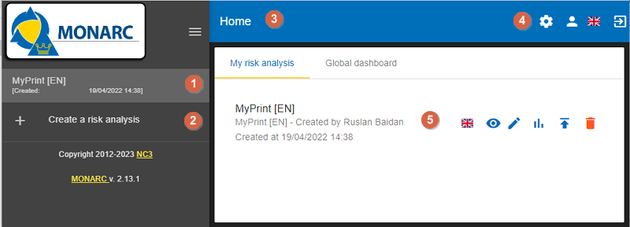

=== Home page

Immediately after user authentication, the following screen appears.
It may, however, be slightly different, if there is not yet an analysis created or if
there are already several and according to the state of progress of the analysis.

On the Home page, the following main areas and functionalities can be found:

1. List of existing analyses. In this case, there is only one. Click on the analysis to select it. (See <<Main risk analysis view>>).
2. Click to `create a risk analysis`. (See <<Creating a Risk Analysis>>.).
3. Navigation bar.
4. Administration of the client environment. Click on `Administration`, `Account`, `Interface language` or `Logout` (see <<Client Environment Administration>>).
5. Graph showing the statistics of the last modified risk analysis.

[sidebar]
.New in MONARC v2.14.1
--
When the current user is linked to an active analysis supervisor, the `My risk analysis` list can also display a `My assignments` indicator with owned and approval counts.
If at least one assigned risk exists, the `Manage my risks` button opens the dedicated `Risks management` view directly from the home page.
--

image::AnalysesViewForSupervisor.png[My risk analysis assignments for a supervisor,pdfwidth=85%,width=85%,align=center]

=== Creating a Risk Analysis

After clicking on `Create a risk analysis`, 

image:RiskAnalysis_1_800.png[Create a risk analysis]

the following pop-up appears:

image:RiskAnalysis_2_800.png[Create a risk analysis popup]

1. *Source*: By default, the creation of a risk analysis is based on an existing model. There are two choices for this:
       
        a.	`List of risks models`: This option proposes available models in the knowledge bases. It has at least two choices, `Modelling NC3`, and the `Blank model`.
        Modelling NC3 is the default template made available by the MONARC editor. It provides sufficient knowledge bases to start a risk analysis. This option should be used by default to start a new risk analysis. 

        The Blank model is empty. This template is typically used temporarily as a Sandbox to test the contents of an import file, for example.

        b.	`Existing analysis`: By choosing this radio button, you can duplicate the risk analysis of your choice present in your environment.

2.	*Description*: Give a meaningful description of your risk analysis.
3.	*Language*: From the dropdown menu, choose a preferred language you want to use for your risk analysis (French, English, German, or Dutch).
4.	*Name*: Give a name to your risk analysis.
5.	*Description*: An optional field, which allows you to describe your analysis in more detail.

[sidebar]
.New in MONARC v2.14.1
--
Available from MONARC v2.14.1, `Empty analysis` lets you start without a preconfigured model. Enable the switch at the top of the creation window.
This disables model and source selection, clears selected referentials, and lets you select any active system language.

Creating a risk analysis now offers the `Empty analysis` option. It creates a completely empty risk analysis, without data in the Knowledge Base or Assets library. MONARC still creates the evaluation-scale baseline required to configure the analysis. Use this option when you want to build the scope and knowledge base from scratch. See https://github.com/monarc-project/MonarcAppFO/issues/324[issue #324] for the associated release item.

image::EmptyAnalysis.png[Empty analysis option,pdfwidth=75%,width=75%,align=center]
--

=== Main risk analysis view

image:RiskAnalysis_3_800.png[Main view]

1.  Risk Analyses panel: Create and select a risk analysis.

TIP: Once the analysis has been selected, the left column can be retracted in order to optimize the horizontal space by clicking on the symbol
image:HideRiskAnalysesPanel.png[Hide Risk Analyses panel icon,pdfwidth=4%,width=3%].

[start=2]
.  Navigation panel: User administration and account management.
.  Access to the steps of the method by clicking on numbers `1` to `4`.
.  Contextual working areas of analysis.

<<<
